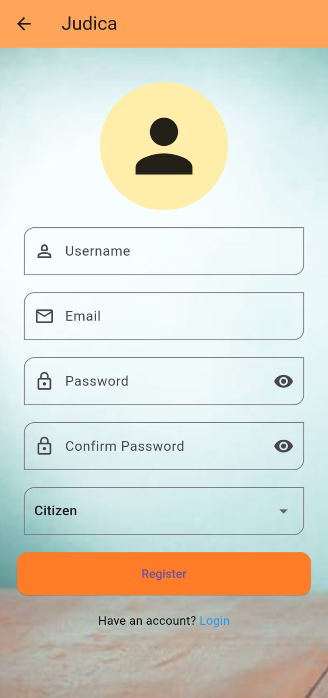
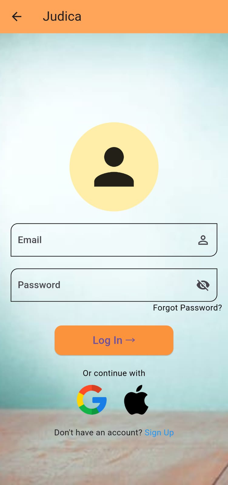
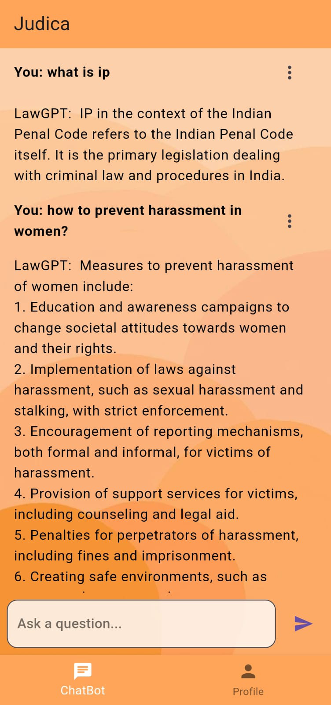
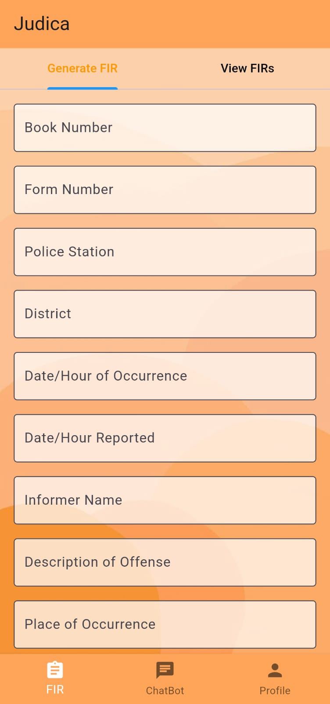
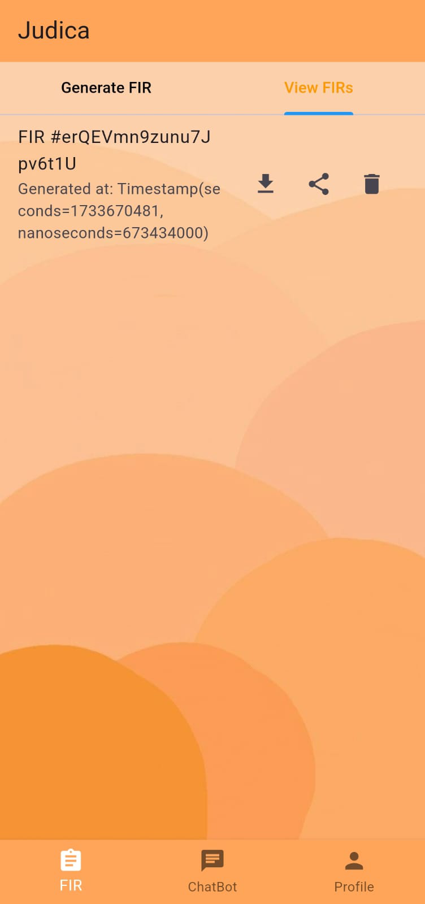
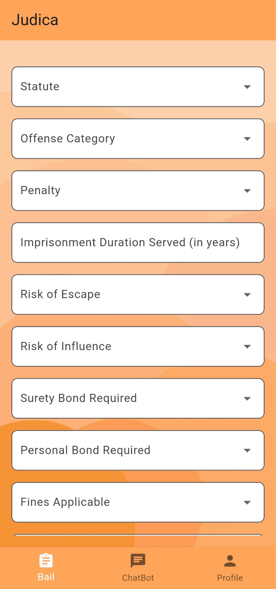
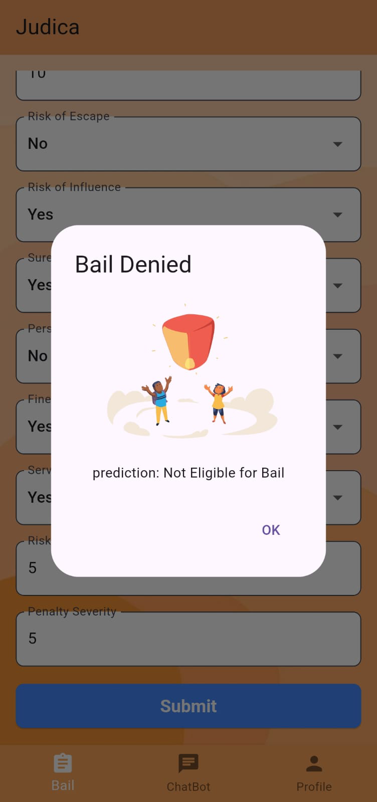
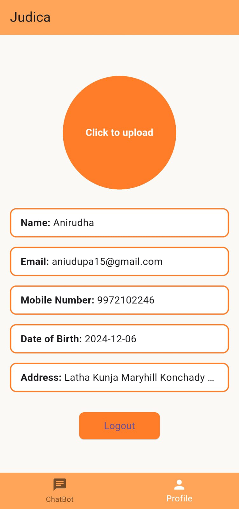

# Judica

🚀 **Judica** is an innovative mobile application built using Flutter, Firebase, and Machine Learning integrated through FastAPI. Designed to revolutionize legal processes, Judica provides tailored features for three types of users: **Citizens**, **Police**, and **Advocates**. With state-of-the-art APIs and a user-friendly interface, Judica brings legal assistance to your fingertips.

---

## 🌟 Features

### 👨‍💼 Citizens
- **🤖 Law Chatbot**: Ask legal queries and get instant responses.
- **👤 Profile Section**: Manage your account and view personal details.

### 👮 Police
- **📜 FIR Generation**: Seamless process for creating and managing FIRs.
- **🤖 Chatbot**: Interact with an AI assistant for assistance.
- **👤 Profile**: Manage police-specific details.

### ⚖️ Advocates
- **🔍 Bail Predictor**: Predict the likelihood of bail using advanced ML models.
- **🤖 Lawbot**: Get detailed legal insights with AI assistance.
- **👤 Profile Page**: Manage advocate-specific details.

---

## 🛠️ Tech Stack
- **Frontend**: Flutter
- **Backend**: Firebase
- **Machine Learning**: Integrated using FastAPI

---

## 🤖 APIs Used
Judica integrates with multiple APIs to deliver a seamless experience:

1. **Judica-API**: Powers advanced natural language processing features.  
   - Documentation: [Hugging Face API](https://github.com/Aniudupa15/Judica-API.git)

2. **Firebase API**: Handles authentication, real-time database, and cloud storage.  
   - Documentation: [Firebase Docs](https://firebase.google.com/docs)

---

## 🎨 Screenshots

### App Screens

<p align="center">
  
  
  
</p>

<p align="center">
  
  
  
</p>

<p align="center">
  
  
  
</p>

To view all screenshots in detail, check the `/screenshots` folder in the repository.

---

## 👥 Contributors
We appreciate the hard work of our contributors:
- [Charanya](https://github.com/kcharanya20)
- [Jonathan](https://github.com/Jonathan-Dsouza1)
- [Chethana](https://github.com/ChethanaGwda)

---

## 🚀 Installation Steps

1. **Clone the Repository**
   ```bash
   git clone https://github.com/Aniudupa15/Judica_AI.git
   cd judica
   flutterfire configure
   ```

2. **Install Flutter**
   Follow the official Flutter installation guide: [Flutter Install](https://flutter.dev/docs/get-started/install)

3. **Set Up Firebase**
   - Create a Firebase project in the [Firebase Console](https://console.firebase.google.com/).
   - Download the `google-services.json` file for Android and/or `GoogleService-Info.plist` for iOS.
   - Place these files in the respective directories of your Flutter project.

4. **Install Dependencies**
   ```bash
   flutter pub get
   ```

5. **Run the Application**
   ```bash
   flutter run
   ```

6. **Set Up FastAPI Backend**
   - Clone the ML repository and follow the setup instructions provided there.
   - Ensure the FastAPI server is running and accessible.

---

## 📖 Usage
1. Open the app and register as a Citizen, Police, or Advocate.
2. Explore features like chatbots, FIR generation, bail prediction, and more.

---

## 🤝 Contributing
We welcome contributions to improve **Judica**! Feel free to fork the repository and submit a pull request.

1. Fork the repo.
2. Create a new branch.
3. Make your changes.
4. Submit a pull request.

---

## 📜 License
This project is licensed under the MIT License. See the LICENSE file for details.

---
